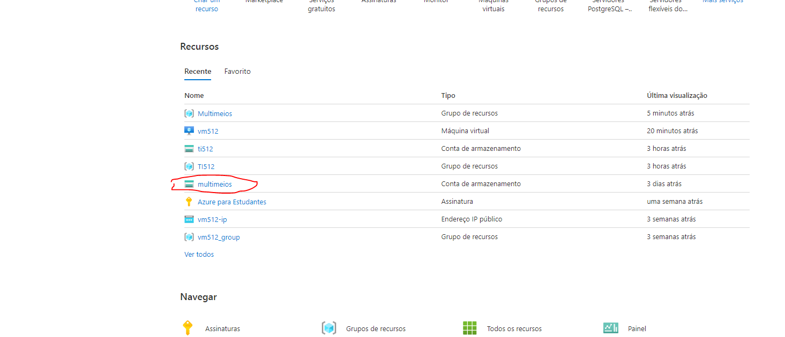
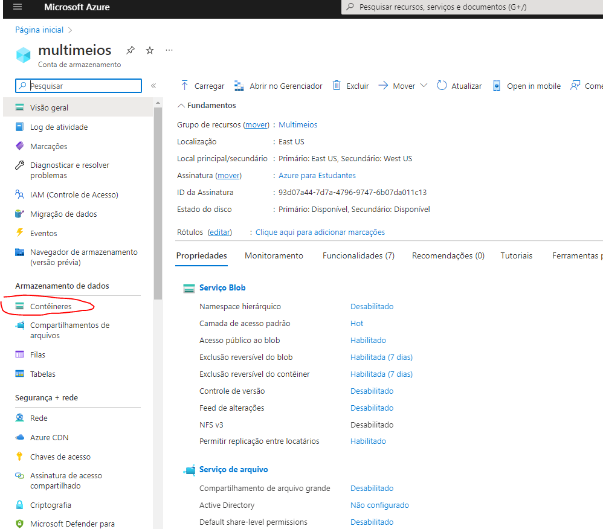
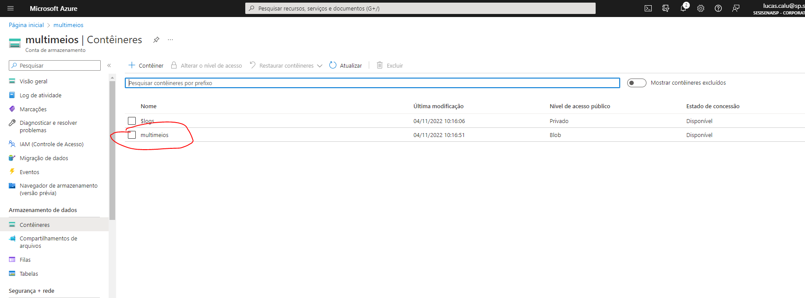
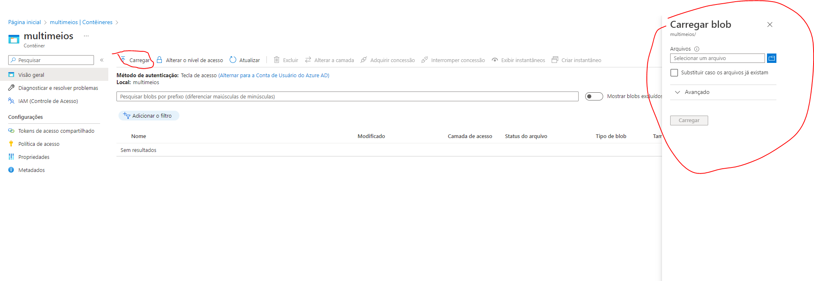
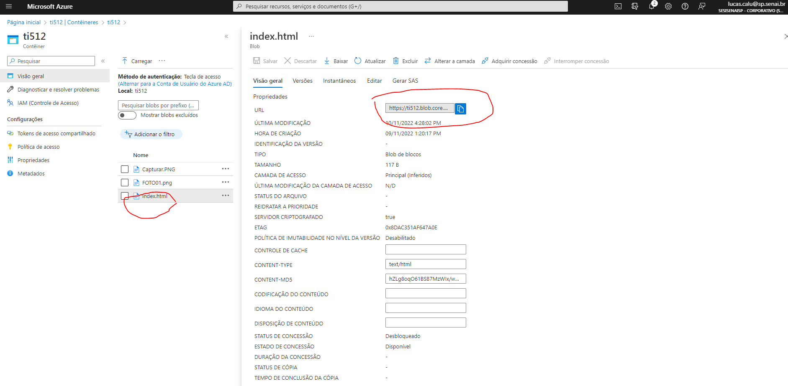

# AZ-900-HOST-STATIC-WEB-SITE

Acesse https://portal.azure.com/#home

Dentro da guia recursos procure por sua conta de armazenamento criada

Clique em containers

Clique em carregar e suba seus arquivos web tais como Index.html,Style.css,etc

Clique sobre o arquivo para conseguir visualizar a URL do seu site

# Parabéns você hospedou seu site estático com sucesso!
